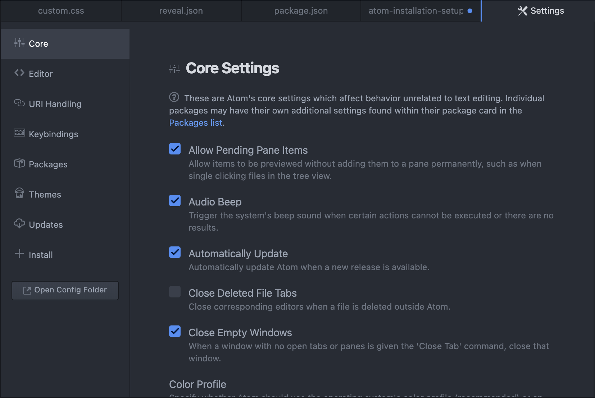
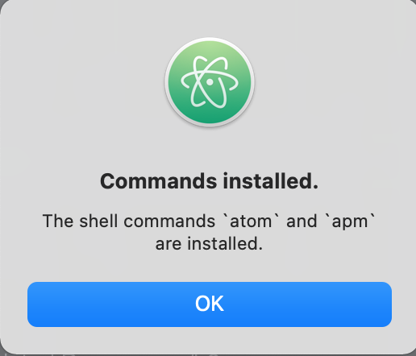

<h1 class="capitalize">COMD2451</h1>
<h2 class="capitalize center">Atom Installation and Setup</h2>

---

<section class="section">
	<h2 class="sentence">So what is Atom?</h2>

`Atom` is the `text editor` that was ***originally created*** by `Github`. Now that `Github` is **owned** by `Microsoft`, ***technically*** `Microsoft` is **maintaining** `Atom`. And ***yes***, it is **being maintained**. There are ***a lot*** of **people** `watching` the [Atom repository on Github](https://github.com/atom/atom), `starring` the `repository`, and ***actually using*** the `editor`.

</section>

---

<section class="section">
	<h2 class="sentence">Installing Atom</h2>

To ***install*** `Atom`, please go to the [Atom.io](https://atom.io/) website to download.

When you have **landed** on the **site**, ***click*** on the **yellow** `download` **button** to **install**.

Once you have **installed** it, you can **launch** it by **typing** `Atom` in `Spotlight Search` on your `Mac`, and then **pressing** the `return/enter` key.

</section>

---

<section class="section">
	<h2 class="sentence">Installing Atom Packages</h2>

In **order** to **install** `Atom` **packages**, go to the `Atom` **tab** itself and **select** `Preferences`. it will **take you** to an `area` that **looks** like ***this***:

	

Click on `+install` and you will be **taken** to a ***list*** of **available packages** you can **install** in `Atom`. And ***imagine***, there is a `note package` ***similar*** to (but much better than) the `Adobe Brackets` **Notes extension**! I have ***included*** it in the **list** of `must-have` **packages** for `Atom` in the ***next slide***.

</section>

---

<section class="section">
	<h2 class="sentence">Must-Have Atom extensions</h2>

+ `atom-beautify`: Beautify HTML, CSS, JavaScript, PHP, Python, Ruby, Java, C, C++, C#, Objective-C, CoffeeScript, TypeScript, Coldfusion, SQL, and more in Atom.

+ `atom-css-comb`: CSScomb is a coding style formatter for CSS (LESS|SASS|SCSS). You can easily write your own configuration to make your style sheets beautiful and consistent.

+ `atom-live-server`: Launch a http server with live reload capability.

+ `atom-notes`: Embedded Notational Velocity-like features for Atom.

+ `color-picker`: Right click and select Color Picker, or hit CMD-SHIFT-C/CTRL-ALT-C to open it. Currently reads HEX, HEXa, RGB, RGBa, HSL, HSLa, HSV, HSVa, VEC3 and VEC4 colors – and is able to convert between the formats. It also inspects Sass and LESS color variables. Just open the Color Picker with the cursor at a variable and it'll look up the definition for you. From there, you can click the definition and go directly to where it's defined.

+ `css-grid-snippets`: CSS Grid Layout Snippets.

+ `css-snippets`: CSS, SCSS, Sass, and Less Snippets.

+ `html-tag-auto-complete`: A simple auto completion of html tags with class and/or id.

+ `html-template-generator`: HTML template generator for Atom text editor.

+ `html-to-css`: Generate CSS classes from HTML structure.

+ `ide-css`: Atom-IDE for CSS, LESS and SCSS language.

+ `ide-html`: Atom-IDE for HTML, Go Template, Mustache and other Templates.

+ `language-atom-notes`: Syntax Highlighting for Atom Notes.

+ `linter`: Linter is a base linter provider for the hackable Atom Editor. Additionally, you need to install a specific linter for your language. You will find a full list on [atomlinter.github.io](https://atomlinter.github.io/). It provides a top-level API to its consumer so that they can visualize errors and other types of messages with ease.

+ `linter-csslint`: Lint CSS on the fly, using csslint. It will be used with files that have the "CSS" or "HTML" syntax.

+ `linter-spell`: Multilingual grammar-specific spell checking using Ispell-interface such as Aspell or Hunspell..

+ `linter-ui-default`: Default UI for the Linter package.

+ `platformio-ide-terminal`: A terminal package for Atom, complete with themes, API and more for PlatformIO IDE. Fork of terminal-plus.

</section>

---

<section class="section">
	<h2 class="sentence"> The <code>atom .</code> shell command</h2>

***Last*** of **all**, ***after*** you have **installed** all your `Atom` **packages**, if you **use** `Terminal` in your **daily workflow**, ***don’t forget*** to **install** the `atom .` **shell command**. This ***permits you*** to **open** your `project` from `Terminal`. Then, once you have done that, you can **use** the `platform side terminal` **integrated** `Terminal` from ***inside*** your `project`!

To ***open*** your **integrated** `Terminal` from **inside** your `project` (it’s the ***same shortcut*** in `VS Code`), just **press** the `Control key` on `Mac`, ***followed by*** the `back tick key` (located below the `tilde symbol` in the ***same key***, and ***this key*** is **located** right below the `esc key`.

</section>

---

<section class="section">
	<h2 class="sentence">Installing a shell command in Atom</h2>

To ***install*** a `shell command` in `Atom`, **select** the `Atom` **tab** itself ***inside*** `Atom`, and **select** `“install Shell Commands”`. When you have done that, `Atom` will **let** you **know** that the `commands` have been **installed**.

	

</section>

---

<section class="section">
	<h2 class="sentence">Related Resources</h2>

- [atom.io](https://atom.io/)

</section>
